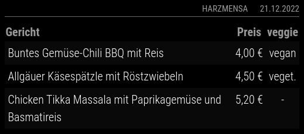

# MMM-Canteen

**MMM-Canteen** is a module for the [MagicMirror²](https://github.com/MagicMirrorOrg/MagicMirror) project.

It shows the menu including the prices of canteens from universities in Germany and Switzerland (based on [openmensa.org](https://openmensa.org)).

## Screenshots

### Example of a canteen in Halle with veggie information



### Example of a canteen in Leipzig without veggie information


## Installation

Just clone the module into your modules directory:

```bash
cd ~/MagicMirror/modules
git clone https://github.com/KristjanESPERANTO/MMM-Canteen/
```

## Configuration

To use this module, add it to the `config.js` file. Here is an example:

```javascript
    {
      module: "MMM-Canteen",
      position: "bottom_center",
      config: {
        canteenName: "Mensa am Park",
        canteen: 63,
        status: "employees",
        switchTime: "15:00",
        showVeggieColumn: true,
        showOnlyKeywords: ["vegan", "vegetarisch", "vegetarische"],
        blacklistKeywords: []
      }
    },
```

It is also possible to add multiple instances. Here is a simple example:

```javascript
    {
      module: "MMM-Canteen",
      position: "top_left",
      config: {
        canteenName: "Mensa 1",
        canteen: 240
      }
    },
    {
      module: "MMM-Canteen",
      position: "top_right",
      config: {
        canteenName: "Mensa 2",
        canteen: 241,
      }
    },
```

### Configuration options

<!-- prettier-ignore-start -->
| Option             | Description                                                                                                                                                                 | Type              | Default                             |
|--------------------|-----------------------------------------------------------------------------------------------------------------------------------------------------------------------------|-------------------|-------------------------------------|
| `updateInterval`   | Interval to update data                                                                                                                                                     | Integer           | `10 * 60 * 1000` (= 10 minutes)     |
| `canteen`          | ID from the openmensa.org url                                                                                                                                               | Integer           | `63` (= Mensa am Park, Uni Leipzig) |
| `status`           | Your status  <br> **Possible values:** `"employees"`, `"students"`, `"pupils"`, `"others"`                                                                                  | String            | `"employees"`                       |
| `truncate`         | Truncate more than x letters                                                                                                                                                | Integer           | `100`                               |
| `canteenName`      | Name of the canteen                                                                                                                                                         | String            | `"Kantine"`                         |
| `switchTime`       | Shows the menu from next day, if switchTime < now                                                                                                                           | Timestamp (HH:mm) | `"16:00"`                           |
| `animationSpeed`   | Speed of the update animation (in milliseconds).<br>If you don't want that the module blinks during an update, set the value to `0`. <br> **Possible values:** `0` - `5000` | Integer           | `500`                               |
| `showVeggieColumn` | Show Veggie Column or not                                                                                                                                                   | Boolean           | `true`                              |
| `showOnlyKeywords` | Show only meals with case-insensitive keywords in notes or category                                                                                                         | String[]          | `["vegan", "vegetarisch", "vegetarische"]`                                |
| `blacklistKeywords` | Don't show meals with these case-insensitive keywords in notes or category                                                                                                  | String[]          | `[]`                                |
<!-- prettier-ignore-end -->

## Update

Go to the module’s directory and pull the latest version from GitHub:

```bash
cd ~/MagicMirror/modules/MMM-Canteen
git pull
```

## Special Thanks

- [Michael Teeuw](https://github.com/MichMich) for creating the inspiring project [MagicMirror²](https://github.com/MagicMirrorOrg/MagicMirror).
- [k-0](https://github.com/k-0/) for initiating this module. Since he does not react to Pull Requests, I continue to maintain the module as a fork here.
- The great community of MagicMirror² that keeps this impressive project alive and permanently improves it.
- All contributors for finding and fixing errors in this module.

## Contributing

If you find any problems, bugs or have questions, please [open a GitHub issue](https://github.com/KristjanESPERANTO/MMM-Canteen/issues) in this repository.

Pull requests are of course also very welcome 🙂

### Code of Conduct

Please note that this project is released with a [Contributor Code of Conduct](CODE_OF_CONDUCT.md). By participating in this project you agree to abide by its terms.

### Developer commands

- `npm install` - Install development dependencies.
- `node --run lint` - Run linting and formatter checks.
- `node --run lint:fix` - Fix linting and formatter issues.
- `node --run test` - Run linting and formatter checks + run spelling check.
- `node --run test:spelling` - Run spelling check.

## License

This project is licensed under the MIT License - see the [LICENSE](LICENSE.md) file for details.

## Changelog

All notable changes to this project will be documented in the [CHANGELOG.md](./CHANGELOG.md) file.
